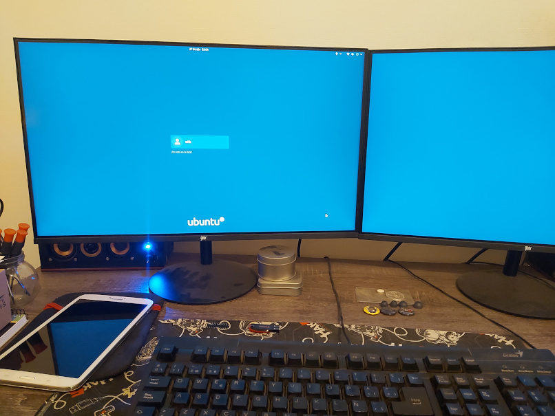

# Gnome Shell 3 Helper

Python script for initialize, compile and deploy Gnome Shell 3 themes.

Tested on Ubuntu 20.04.


## Use

The help message for begin:

```bash
$ python3 helper.py
Gnome Shell 3 Helper - v1.0.1-stable
Use: python3 helper.py [option] [arguments]
Options:
  -h, --help                Print the help message.
      --init [folder]       Initialize project in the specific folder.
      --compile [folder]    Compile project from specific folder.
      --install [gresource] Install specific gresource file.
      --uninstall [alternative path]
                            Uninstall specific alternative gresource path.
                            For show all alternatives ejecute this command:
                            update-alternatives --query gdm3-theme.gresource
```

Example of use (change pink splash login for a light blue background):

```bash
# Initialize project
$ python3 helper.py --init CustomLoginColour;
+ Reading gresource compiled content ...
  -> Extracting Yaru-dark/gnome-shell-high-contrast.css ...
  -> Extracting Yaru-dark/gnome-shell.css ...
  ...
  -> Extracting toggle-on-hc.svg ...
  -> Extracting toggle-on.svg ...
+ Project created.

# Change colour
$ sed -i 's/#4f194c/#19364f/g' CustomLoginColour/gdm3.css;

# Compile project
$ python3 helper.py --compile CustomLoginColour/;
+ Creating resources XML ...
+ Compilling all resources ...
+ Project compiled.

# Checking file integrity (optional)
$ file CustomLoginColour.gresource;
CustomLoginColour.gresource: GVariant Database file, version 0

# Install new theme
$ sudo python3 helper.py --install CustomLoginColour.gresource;
+ Installing compilled theme ...
  - Copying gresource file ...
  - Installing alternative ...
  - Applying alternative ...
+ Theme is installed!

# Validate the installation (optional)
$ update-alternatives --query gdm3-theme.gresource
Name: gdm3-theme.gresource
Link: /usr/share/gnome-shell/gdm3-theme.gresource
Status: manual
Best: /usr/share/gnome-shell/theme/Yaru/gnome-shell-theme.gresource
Value: /usr/local/share/gnome-shell/theme/CustomLoginColour.gresource
...
```

Example result:



For uninstall:

```bash
# Uninstall
$ sudo python3 helper.py --uninstall /usr/local/share/gnome-shell/theme/CustomLoginColour.gresource;
 Uninstalling theme ...
  - Uninstalling alternative ...
  - Deleting gresource file ...
+ Theme is uninstalled.
+ For more info execute this command:
  update-alternatives --query gdm3-theme.gresource

# Validating (optional)
$ update-alternatives --query gdm3-theme.gresource
Name: gdm3-theme.gresource
Link: /usr/share/gnome-shell/gdm3-theme.gresource
Status: auto
Best: /usr/share/gnome-shell/theme/Yaru/gnome-shell-theme.gresource
Value: /usr/share/gnome-shell/theme/Yaru/gnome-shell-theme.gresource
...
```

In python script you can modify the base template, by default use the Ubuntu
20.04 template file in `gres-source` property.


## Dependencies

- Python 3
- libglib2.0-dev-bin
- Root user (for install and uninstall only)